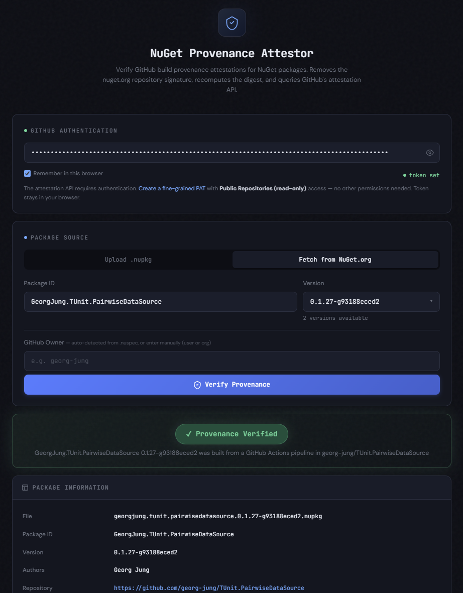

# NuGet Provenance Attestor

Lightweight browser-based tool for checking GitHub build provenance attestations for NuGet packages.

It removes the `nuget.org` repository signature from a `.nupkg`, recomputes the digest, and looks up matching attestations through GitHub's attestation API.

## What It Does

- Fetch a package from `nuget.org` or inspect a local `.nupkg`
- Recompute the package digest after removing `.signature.p7s`
- Auto-detect the GitHub owner from package metadata when possible
- Query GitHub attestations and show a clear verification result

## Usage

1. Open [`index.html`](./index.html) in a browser.
2. Add a GitHub fine-grained PAT with `Public Repositories (read-only)` access.
3. Upload a `.nupkg` or fetch one from `nuget.org`.
4. Run **Verify Provenance**.

## Notes

- This is a single-file client-side app. No build step required.
- The tool helps with digest matching and attestation lookup, but it does not perform full cryptographic verification. For that, use `gh attestation verify` or `sigstore-js`.
